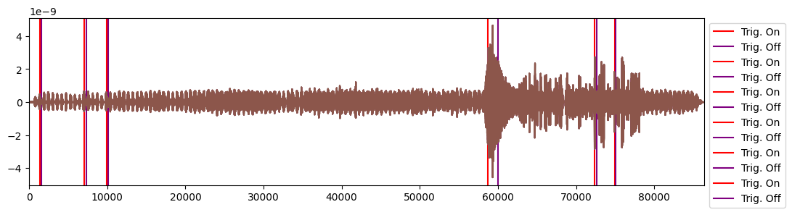
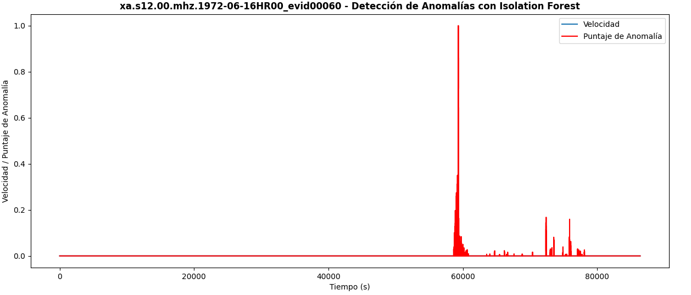
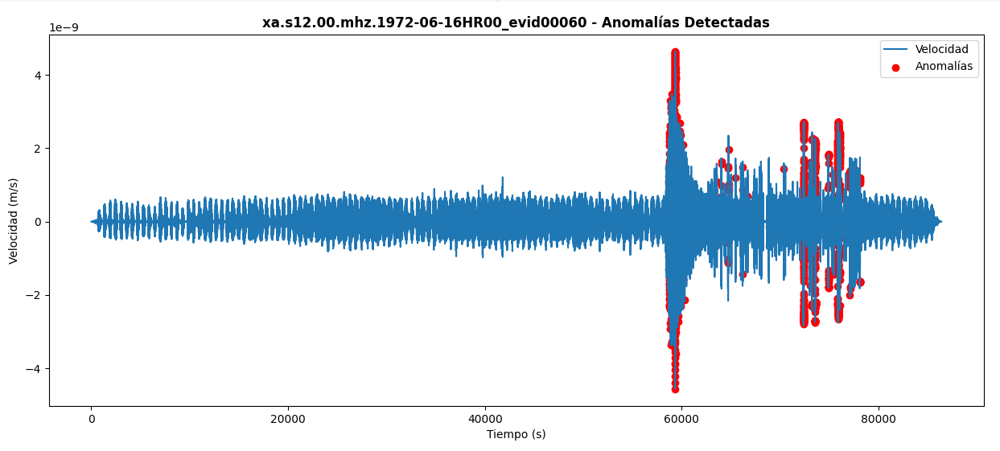
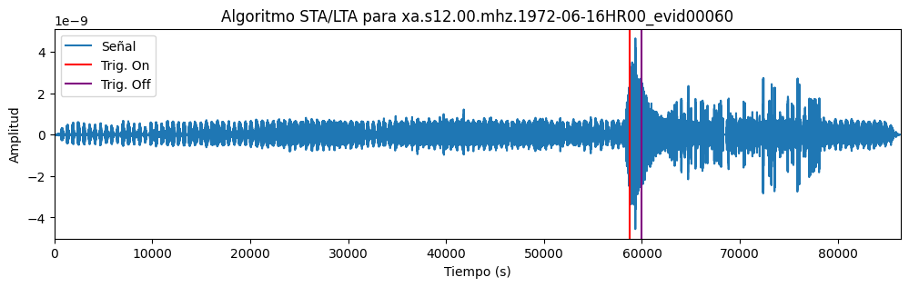
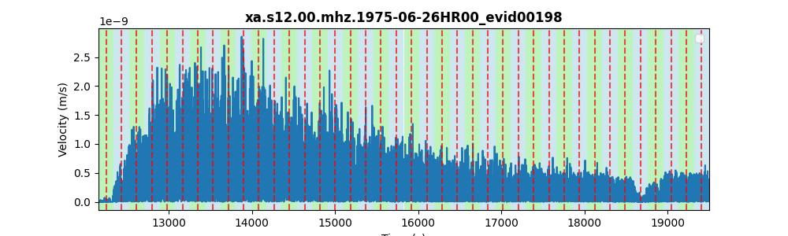

# Solar System Seismonauts 🌔🌌 - NASA Space Apps 2024
Welcome to the **Solar System Seismonauts** repository, a project developed for the **NASA Space Apps Challenge 2024**.


## Challenge

The challenge is to write a computer program to analyze real data from the Apollo missions and the Mars Interior Exploration using Seismic Investigations, Geodesy and Heat Transport (InSight) Lander to identify seismic events! The Example Resources section provides a data packet with continuous seismic records from these missions arranged in training and test subsets, catalogs showing when the known seismic records occur in the training data, and a Python Jupyter Notebook with helpful codes to help you get started. Your team can look at these records to understand the qualities of planetary seismic data, and then try your hand at finding all the seismic events in the test dataset. Maybe you’ll find some additional events not in the current catalogs!

More info [here](https://www.spaceappschallenge.org/nasa-space-apps-2024/challenges/seismic-detection-across-the-solar-system/)

## Project Description 🚀

By studying seismic waves and how fast they travel, we can probe the structure and composition of the Earth and other planets as well, which is crucial for establishing habitability parameters of exoplanets. However, there's just one hiccup: sending data back over long distances in space requires a lot of power. To address this challenge, our team has implemented the following solution:

We used a two-phase ensemble model. First, we applied the STA/LTA algorithm, a state-of-the-art method for seismic detection. We optimized a grid of hyperparameters (windows and triggers) to minimize the mean absolute error (real relative time - predicted relative time) over a training set of 10 files, which outputs different candidate windows for seismic events.

In the (majority) case where the algorithm generated multiple candidate windows for a seism, the predicted window was selected as the one with the highest density of anomalies detected by the Isolation Forest algorithm.

This approach resulted in remarkable outcomes on a training set of 50 files, with a mean absolute error of less than 180 seconds in almost 40 out of the 50 files.

Sonification is the representation of data sets through sound to facilitate their communication and interpretation. We implemented this concept in the challenge because, not only does it provide a solution to the problem, but it also brings this type of project closer to the public by allowing them to appreciate the data through both music and visualizations, as we have done. This makes the data more accessible.

Additionally, sonification is already used in science to assist blind scientists, among other applications. Here's how we implemented it:
With the data received from the final algorithm, we filter the time range where the seismic event occurs.

1. We fragment the signal into several parts.
2. We assign a frequency to the velocity (m/s) in each fragment.
3. We merge all the frequencies into a ```.wav``` file.
4. We create an animated graph using data from the CSV file (average and median samples).
5. We add the audio track from step 3 to the video file from step 4.

### Key Features

1. **Seismic wave analysis**: Probing the structure and composition of Earth and other planets.
2. **Energy challenge in space**: Addressing the issue of high energy consumption for long-distance data transmission in space.
3. **Two-phase ensemble model**: Combining the STA/LTA algorithm for seismic detection with an Isolation Forest for anomaly detection.
4. **High accuracy results**: Achieving a 3% mean absolute error in 40 out of 50 training files with less than five minutes error.
5. **Sonification**: Converting data into sound for easier interpretation and communication, making seismic data more accessible to the public.
6. **Data visualization**: Creating an animated graph and merging the audio with video to visualize and present the data effectively.

## Repo Structure

- **notebooks**: Jupyter Notebook files containing the algorithms used in the project. [Here](https://github.com/mgarciate/SolarSystemSeismonauts_NASASpaceApps2024/blob/be3881612db2a215c3e99800a150b016146d7618/notebooks/SEISMIC_DETECTION_FINAL_VERSION.ipynb) is the final version of the notebook.

- **outputs**: Results from the applied algorithms, including multimedia representations organized into different subfolders (videos, GIFs, audios, etc.).
  - The submitted predictions file is `predictions.csv` (also available in Excel format with the same data).

- **scripts/display**: Script to generate multimedia content based on the algorithm's output.

## Installation Requirements 📦
To run this project locally, make sure you have the following requirements installed:

- [Python 3.10.12](https://www.python.org/downloads/) for Algorithm Development.
- [ffmpeg](https://ffmpeg.org)
- Necessary libraries for Algorithm Development part (can be installed using `pip`):
  ```python
  pip install obspy==1.4.1 numpy==1.26.4 pandas==2.2.2 matplotlib==3.7.1 scikit-learn==1.5.2 tqdm==4.66.5 scipy==1.13.1
  ```
## How to Use
Clone this repository:
```bash
git clone https://github.com/mgarciate/SolarSystemSeismonauts_NASASpaceApps2024.git
```
Open the notebook at:
```bash
cd SolarSystemSeismonauts_NASASpaceApps2024/notebooks
```

Or generate multimedia at:
```bash
cd SolarSystemSeismonauts_NASASpaceApps2024/scripts/display
```

### Steps followed with the visual aid of graphs:

1. Obtaining windows via STA/LTA



2. Obtaining anomaly coefficients using isolation forest



3. Combining the signal and the anomalies detected in the isolation forest



4. Obtaining the predicted window



### How to generate multimedia
Install additional libraries
```bash
pip install -r requirements_sonification.txt
```

Run the ```main``` script
```bash
python3 main.py
```

We have automatically generated multimedia content for 50 seismic events detected and analyzed by the algorithm described above, using the following approach:

1. We fragment the signal into several parts.



2. We assign a frequency to the velocity (m/s) in each fragment.


3. We merge all the frequencies into a ```.wav``` file.
```python
    for note in melody_array: # From 0 to n notes
        frequency = notes_frequencies[notes_frequencies_keys[note]]
        t = np.linspace(0, duration, int(sample_rate * duration), False)
        note_signal = 0.5 * np.sin(2 * np.pi * frequency * t)

        fade_in_len = int(sample_rate * fade_duration)
        fade_out_len = int(sample_rate * fade_duration)
        fade_in = np.linspace(0, 1, fade_in_len)
        fade_out = np.linspace(1, 0, fade_out_len)
        
        note_signal[:fade_in_len] *= fade_in
        note_signal[-fade_out_len:] *= fade_out

        melody_signal = np.concatenate((melody_signal, note_signal))
        melody_notes = np.append(melody_notes, notes_frequencies_keys[note])
    
    melody_file = f'../../outputs/melodies/{test_filename}.txt'
    np.savetxt(melody_file, melody_notes, fmt='%s', delimiter=',')
```
4. We create an animated graph using data from the CSV file (average and median samples).
```python
    fig, ax = plt.subplots(figsize=(9, 6))  # Create the plot figure
    camera = Camera(fig)  # Initialize camera for animation
    # Loop to animate step-by-step
    # Loop to animate step-by-step
    for j in range(1, len(mean_values) + 1):  # Loop through all data points
        plt.ylim(0, max(np.max(mean_values), np.max(median_values)))  # Set y-axis limits based on the provided data
        plt.xlim(0, len(mean_values))  # Set x-axis limits to fit the data points
        
        # Plot the partial A and B data up to the current step j
        sns.lineplot(x=range(j), y=mean_values[:j], color='red', label='Mean values')
        sns.lineplot(x=range(j), y=median_values[:j], color='blue', label='Median values')
        
        plt.legend((
            'Real Mean: {:.2e}'.format(sum(mean_values[:j]) / j),
            'Real Median: {:.2e}'.format(sum(median_values[:j]) / j),
        ))
        
        # Add a dynamic title showing the current step
        ax.text(0.5, 1.01, f"time_rel(sec) = {time_intervals[j]}", transform=ax.transAxes)

        camera.snap()  # Take a snapshot for the animation

    # Create the animation from the snapshots
    anim = camera.animate()

    # Save the animation as an MP4 file
    mp4_file = f'{test_filename}.mp4'
    anim.save(mp4_file, writer='ffmpeg', fps=30)
```
5. We add the audio track from step 3 to the video file from step 4.
```python
    output_file = f'../../outputs/videos/{test_filename}.mp4'
    subprocess.run([
        'ffmpeg', 
        '-i', mp4_file,  # Input video file
        '-i', f'{wav_file}',  # Input audio file
        '-c:v', 'copy',  # Copy the video codec (no re-encoding)
        '-c:a', 'aac',  # Use AAC codec for audio
        '-strict', 'experimental',  # Allow experimental aac
        output_file,  # Output video file with sound
        '-y' # Overwrite output file if it exists
    ])
```

### Multimedia output

Navigate to [outputs](./outputs):

- plots


- audio files

Check wav files at [audios](./outputs/audios)

- gifs


- videos

Check more mp4 files at [videos](./outputs/videos)

[](https://www.youtube.com/watch?v=gqtvbya08OU)

- melodies
```
C3,G3,E4,B4,E5,G5,F5,F5,A5,G5,G5,C5,D5,B4,B4,B4,F4,F4,E4,D4,D4,C4,B3,A3,B3,A3,A3,A3,G3,G3,A3,G3,G3,F3,F3,C3,E3,G3,G3,G3
```

## Tools
- Python
- Jupyter Notebook
- Google Codelabs
- ffmpeg

## References
https://www.spaceappschallenge.org/nasa-space-apps-2024/challenges/seismic-detection-across-the-solar-system/

https://medium.com/@pw33392/discover-unusual-patterns-in-time-series-data-with-unsupervised-anomaly-detection-and-isolation-78db408caaed

[Demo Notebook provided in the challenge](https://wufs.wustl.edu/SpaceApps/data/space_apps_2024_seismic_detection.zip)

## License
This project is licensed under the terms of the MIT license.

Thank you for exploring the solar system with us! 🌍🚀
